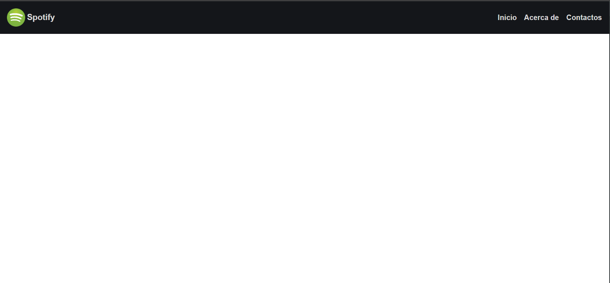
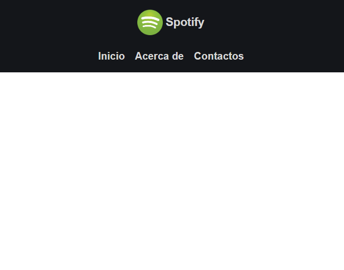

# PROYECTO 4 (Menu basico)

## Captura

pantalla > 680px

pantalla <= 680px

## Contenido aprendido

- Estructura de carpetas
- archivos estaticos
- implementacion favicon
- flexbox
- Diseño responsivo (media queries)
- Division de hojas de estilos(normalize.css,reset.css,main.css)
- Medidas relativas
